# 卷积神经网络简单分享

## 引言

最近机器学习在行业里非常火热，其中神经网络较为突出，所以我也蹭了一下热度去了解了下神经网络中的**卷积神经网络**
（Convolutional Neural Network, CNN）。有关于卷积神经网络如何被用于做图片识别，这里我把一些个人的学习心得跟大家
分享一下，以供大家一起交流学习。因为本人也是初学者，所以如有地方讲得不对请大家务必指出。

## 目录
* 计算机眼中的图片
* 卷积神经网络
    * 概述
    * 卷积层
    * 激活层
    * 池化层
    * 全连接层
* 总结
* 实践：实现手写数据识别
* FAQ
* 参考

## 计算机眼中的图片

要讲CNN如何去识别图片，我们要首先知道计算机是怎样看待一张照片的。就拿一张普通的彩色照片举例，
大家把它放大多倍，可以看出它是由多个像素点所组成的。

**原尺寸**

**放大图**
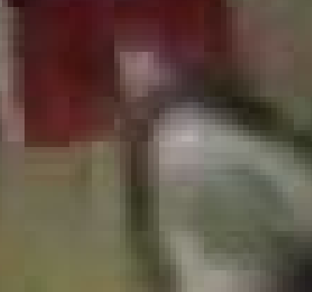

***
然后关于像素点，大家应该都了解**三原色**（RGB三原色通道）。每种颜色取值范围从0~255。所以一个**黑色**像素点可以表示为
`(255,255,255)`。不同颜色可以通过三个通道值组合而成。因此我们一张图片可以看是成一个数字矩阵。（图例是灰度图，颜色通道为1）

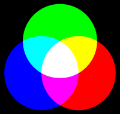
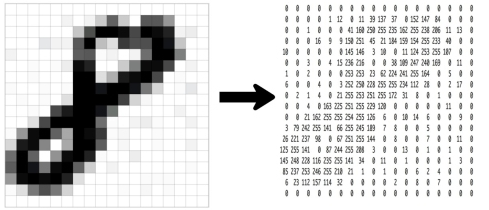

    wiki解释：原色是指不能透过其他颜色的混合调配而得出的“基本色”。
    以不同比例将原色混合，可以产生出其他的新颜色。以数学的向量空间来解释色彩系统，则原色在空间内可作为一组基底向量，
    并且能组合出一个“色彩空间”。由于人类肉眼有三种不同颜色的感光体，因此所见的色彩空间通常可以由三种基本色所表达，
    这三种颜色被称为“三原色”。一般来说叠加型的三原色是红色、绿色、蓝色；

## 卷积神经网络

### 概述

**卷积神经网络**（Convolutional Neural Network, **CNN**）是一种前馈神经网络，它的人工神经元可以响应一部分覆盖范围内
的周围单元，对于大型图像处理有出色表现。
卷积神经网络由一个或多个卷积层和顶端的全连通层（对应经典的神经网络）组成，同时也包括关联权重和池化层（pooling layer）。
这一结构使得卷积神经网络能够利用输入数据的二维结构。与其他深度学习结构相比，卷积神经网络在**图像**和**语音识别**方面能
够给出更好的结果。这一模型也可以使用反向传播算法进行训练。相比较其他深度、前馈神经网络，卷积神经网络需要考量的参数更少，
使之成为一种颇具吸引力的深度学习结构。

### 卷积层

CNN中的卷积层主要是对图片进行卷积操作（**Convolution**）。所谓卷积操作，按我个人理解是对图片进行**特征**（**features**）提取。
CNN识别一张图片是靠特征进行识别的，比如一张图片CNN提取出脸、鼻子、嘴和耳朵等特征，它就会判断这张图片是人脸。

换成具体的操作，卷积是用一个小方阵的数据学习图像特征，可以保留像素之间的空间关系。这里不深入探讨卷积的数学原理，重在理解工作过程。

如上所述，每个图片都是像素值矩阵。考虑一个5x5的图像，其像素值为0和1，下面的绿色矩阵是灰度图的特例（常规灰度图的像素值取值0-255），同时考虑如下的3x3矩阵：
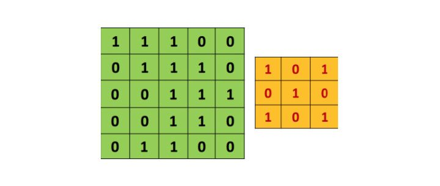

卷积操作如下面动图所示，进行矩阵相乘：

想一想以上操作是如何完成的，我们在原始图片（绿色）上1像素、1像素地滑动橙色矩阵，每次滑动的距离也称**步幅**(**stride**），
并且在每个位置上，我们都对两个矩阵的对应元素相乘后求和得到一个整数，这就是输出矩阵（粉色）的元素。注意，3x3矩阵每次只“看见”输入图片的一部分。

3x3矩阵也叫**滤波器**（**Filter**）、**卷积核（Kernel）**或**特征探测器**，在原图上滑动滤波器、点乘矩阵所得的矩阵称
为**卷积特征**（**features**）、**激励映射**或**特征映射**。这里的重点就是，理解滤波器对于原输入图片来说，是个特征探测器。

为什么说滤波器可以过滤出特征呢，下面举一个例子，以一个标准的**X**图来说明：

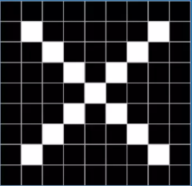

我们要把这些不标准的**X**也识别出来，因为它们都有相同的特征：

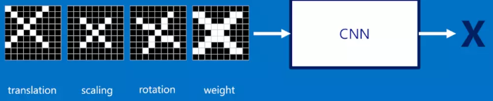
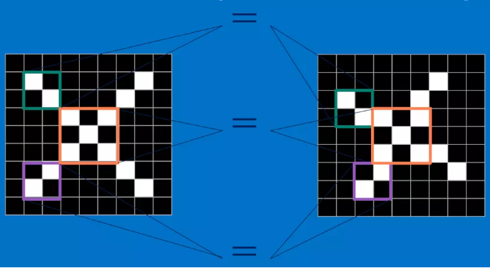

我们把白色的像素设置为1，黑色的像素设置为0，则上述的3个特征可以用以下的滤波器矩阵来表示：

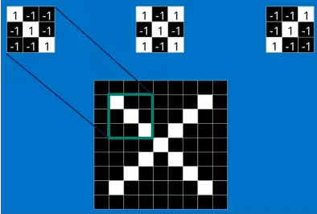

当滤波器与对应特征的图片区域进行卷积操作时，得出来的值是最大的，所以说滤波器可以过滤出图片的特征：

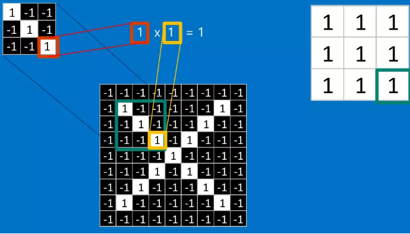
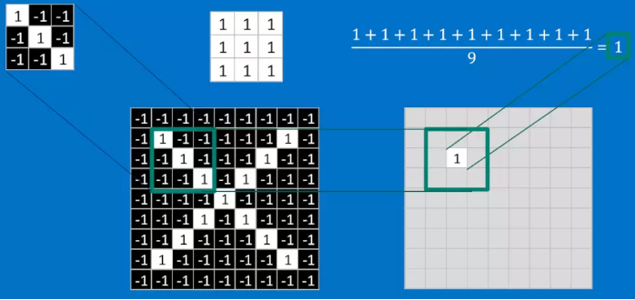

最终的卷积结果如下：
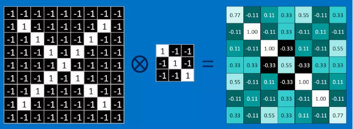

从真实图片卷积操作后的效果如下：

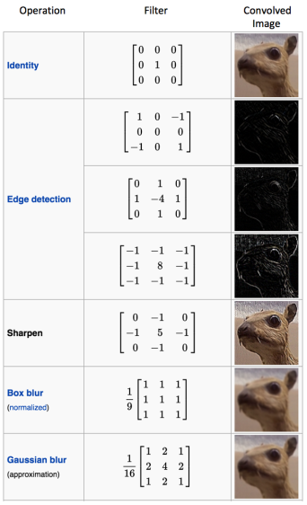

一个滤波器在图片上滑动（卷积）产生特征映射。在同一个图片上，另一个滤波器的卷积产生了不同的特征映射。
须知，卷积操作捕捉的是原图的局部依赖性。另外，注意观察两个不同的滤波器怎样产生不同的特征映射。
其实不管是图片，还是两个滤波器，本质上都不过是我们刚才看过的数值矩阵而已。

在实践当中，滤波器的值在训练网络之初是按正态分布随机生成的，卷积神经网络在训练过程中学习（反向传播&梯度下降）滤波器的值，
当然我们还是要在训练之前需要指定一些参数：滤波器的个数，滤波器尺寸、
网络架构等等。滤波器越多，从图像中提取的特征就越多，模式识别能力就越强。

特征映射的尺寸由三个参数控制，我们需要在卷积步骤之前就设定好：
* 深度(Depth)： 深度就是卷积操作中用到的滤波器个数。如下图所示，我们对原始图用了三个不同的滤波器，
从而产生了三个特征映射。你可以认为这三个特征映射也是堆叠的2d矩阵，所以这里特征映射的“深度”就是3。
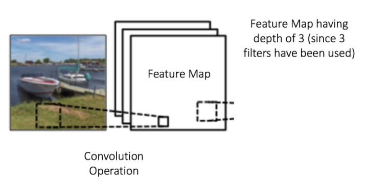

* 步幅(Stride)：步幅是每次滑过的像素数。当Stride=1的时候就是逐个像素地滑动。当Stride=2的时候每次就会滑过2个像素。
步幅越大，特征映射越小。

* 补零(Zero-padding)：有时候在输入矩阵的边缘填补一圈0会很方便，这样我们就可以对图像矩阵的边缘像素也施加滤波器。
补零的好处是让我们可以控制特征映射的尺寸。补零也叫宽卷积，不补零就叫窄卷积。
