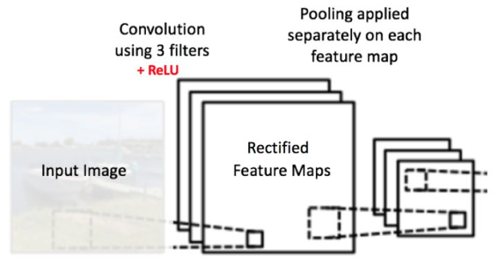
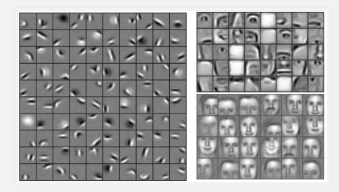

# 卷积神经网络简单分享

## 引言

最近机器学习在行业里非常火热，其中神经网络较为突出，所以我也蹭了一下热度去了解了下神经网络中的**卷积神经网络**
（Convolutional Neural Network, CNN）。有关于卷积神经网络如何被用于做图片识别，这里我把一些个人的学习心得跟大家
分享一下，以供大家一起交流学习。因为本人也是初学者，所以如有地方讲得不对请大家务必指出。

## 目录
* 计算机眼中的图片
* 卷积神经网络
    * 概述
    * 卷积层
    * 激活层
    * 池化层
    * 全连接层
* 总结
* 实践：实现手写数字识别
* 参考

## 计算机眼中的图片

要讲CNN如何去识别图片，我们要首先知道计算机是怎样看待一张照片的。就拿一张普通的彩色照片举例，
大家把它放大多倍，可以看出它是由多个像素点所组成的。

**原尺寸**

**放大图**


***
然后关于像素点，大家应该都了解**三原色**（RGB三原色通道）。每种颜色取值范围从0~255。所以一个**黑色**像素点可以表示为
`(255,255,255)`。不同颜色可以通过三个通道值组合而成。因此我们一张图片可以看是成一个数字矩阵。（图例是灰度图，颜色通道为1）


    wiki解释：原色是指不能透过其他颜色的混合调配而得出的“基本色”。
    以不同比例将原色混合，可以产生出其他的新颜色。以数学的向量空间来解释色彩系统，则原色在空间内可作为一组基底向量，
    并且能组合出一个“色彩空间”。由于人类肉眼有三种不同颜色的感光体，因此所见的色彩空间通常可以由三种基本色所表达，
    这三种颜色被称为“三原色”。一般来说叠加型的三原色是红色、绿色、蓝色；

## 卷积神经网络

### 概述

**卷积神经网络**（Convolutional Neural Network, **CNN**）是一种前馈神经网络，它的人工神经元可以响应一部分覆盖范围内
的周围单元，对于大型图像处理有出色表现。
卷积神经网络由一个或多个卷积层和顶端的全连通层（对应经典的神经网络）组成，同时也包括关联权重和池化层（pooling layer）。
这一结构使得卷积神经网络能够利用输入数据的二维结构。与其他深度学习结构相比，卷积神经网络在**图像**和**语音识别**方面能
够给出更好的结果。这一模型也可以使用反向传播算法进行训练。相比较其他深度、前馈神经网络，卷积神经网络需要考量的参数更少，
使之成为一种颇具吸引力的深度学习结构。

### 卷积层

CNN中的卷积层主要是对图片进行卷积操作（**Convolution**）。所谓卷积操作，按我个人理解是对图片进行**特征**（**features**）提取。
CNN识别一张图片是靠特征进行识别的，比如一张图片CNN提取出脸、鼻子、嘴和耳朵等特征，它就会判断这张图片是人脸。

换成具体的操作，卷积是用一个小方阵的数据学习图像特征，可以保留像素之间的空间关系。这里不深入探讨卷积的数学原理，重在理解工作过程。

如上所述，每个图片都是像素值矩阵。考虑一个5x5的图像，其像素值为0和1，下面的绿色矩阵是灰度图的特例（常规灰度图的像素值取值0-255），同时考虑如下的3x3矩阵：


卷积操作如下面动图所示，进行矩阵相乘：


想一想以上操作是如何完成的，我们在原始图片（绿色）上1像素、1像素地滑动橙色矩阵，每次滑动的距离也称**步幅**(**stride**），
并且在每个位置上，我们都对两个矩阵的对应元素相乘后求和得到一个整数，这就是输出矩阵（粉色）的元素。注意，3x3矩阵每次只“看见”输入图片的一部分。

3x3矩阵也叫**滤波器**（**Filter**）、**卷积核（Kernel）**或**特征探测器**，在原图上滑动滤波器、点乘矩阵所得的矩阵称
为**卷积特征**（**features**）、**激励映射**或**特征映射**。这里的重点就是，理解滤波器对于原输入图片来说，是个特征探测器。

为什么说滤波器可以过滤出特征呢，下面举一个例子，以一个标准的**X**图来说明：


我们要把这些不标准的**X**也识别出来，因为它们都有相同的特征：


我们把白色的像素设置为1，黑色的像素设置为-1，则上述的3个特征可以用以下的滤波器矩阵来表示：


当滤波器与对应特征的图片区域进行卷积操作时，得出来的值是最大的，所以说滤波器可以过滤出图片的特征：


最终的卷积结果如下：


从真实图片卷积操作后的效果如下：


一个滤波器在图片上滑动（卷积）产生特征映射。在同一个图片上，另一个滤波器的卷积产生了不同的特征映射。
须知，卷积操作捕捉的是原图的局部依赖性。另外，注意观察两个不同的滤波器怎样产生不同的特征映射。
其实不管是图片，还是两个滤波器，本质上都不过是我们刚才看过的数值矩阵而已。

在实践当中，滤波器的值在训练网络之初是按正态分布随机生成的，卷积神经网络在训练过程中学习（反向传播&梯度下降）滤波器的值，
当然我们还是要在训练之前需要指定一些参数：滤波器的个数，滤波器尺寸、
网络架构等等。滤波器越多，从图像中提取的特征就越多，模式识别能力就越强。

特征映射的尺寸由三个参数控制，我们需要在卷积步骤之前就设定好：
* 深度(Depth)： 深度就是卷积操作中用到的滤波器个数。如下图所示，我们对原始图用了三个不同的滤波器，
从而产生了三个特征映射。你可以认为这三个特征映射也是堆叠的2d矩阵，所以这里特征映射的“深度”就是3。


* 步幅(Stride)：步幅是每次滑过的像素数。当Stride=1的时候就是逐个像素地滑动。当Stride=2的时候每次就会滑过2个像素。
步幅越大，特征映射越小。

* 补零(Zero-padding)：有时候在输入矩阵的边缘填补一圈0会很方便，这样我们就可以对图像矩阵的边缘像素也施加滤波器。
补零的好处是让我们可以控制特征映射的尺寸。补零也叫宽卷积，不补零就叫窄卷积。

### 激活层
在上述的卷积操作中，我们得到了很多图片的特征集（Feature Map）。这时候我们要使用**激活函数**来激活这个特征集。
**激活函数**是人工神经网络的一个极其重要的特征。它决定一个神经元是否应该被激活，激活代表神经元接收的信息与给定的信息有关。


当我们不用激活函数时，权重和偏差只会进行线性变换。线性方程很简单，但解决复杂问题的能力有限。


没有激活函数的神经网络实质上只是一个线性回归模型。激活函数对输入进行非线性变换，使其能够学习和执行更复杂的任务。
我们希望我们的神经网络能够处理复杂任务，如语言翻译和图像分类等。线性变换永远无法执行这样的任务。激活函数可以把
我们的神经网络转换成非线性。


由于激活函数涉及的知识较多，这里不展开细说，有兴趣的同事可以自行研究，这里只简单介绍一下常用的激活函数，和该如何
选择激活函数。目前表现最好的激活函数是**ReLu**函数。它可以把小于0的数值转换成0。


其它常用的激活函数有以下几种：
* softmax
* elu
* selu
* softplus
* softsign
* tanh
* sigmoid
* hard_sigmoid
* linear
***

#### 如何选择正确的激活函数？

现在我们已经了解了这么多的激活函数，接下来就需要分析在哪种情况下应该使用哪种激活函数了。
激活函数好或坏，不能凭感觉定论。然而，根据问题的性质，我们可以为神经网络更快更方便地收敛作出更好的选择。

* 用于**分类器**时，**Sigmoid**（**二分类**）函数或者**SoftMax**（**多分类**）及其组合通常效果更好。
* 由于梯度消失问题，有时要避免使用sigmoid和tanh函数。
* ReLU函数是一个**通用**的激活函数，目前在大多数情况下使用。
* 如果神经网络中出现死神经元，那么PReLU函数就是最好的选择。
* **请记住，ReLU函数只能在隐藏层中使用**（例如输出层一般作为分类器，不使用ReLU）。

#### 你可以默认选择ReLU函数，如果ReLU函数没有提供最优结果，再尝试其他激活函数。
***
### 池化层
在经过上述的卷积、激活操作后，我们要对特征集做**池化**（**pooling**）操作（也叫**亚采样**或**下采样**）。池化
降低了每个特征映射的维度，但是保留了最重要的信息。空间池化可以有很多种形式：最大(Max)，平均(Average)，求和(Sum)等等。

以最大池化为例，我们定义了空间上的邻域（2x2的窗）并且从纠正特征映射中取出窗里最大的元素。
除了取最大值以额外，我们也可以取平均值（平均池化）或者把窗里所有元素加起来。实际上，最大池化已经显示了最好的成效。

池化是比较好理解的数学操作，如下图为最大池化：


池化可以将一幅大的图像缩小，同时又保留其中的重要信息。它就是将输入图像进行缩小，减少像素信息，只保留重要信息。
通常情况下，池化都是**2*2**大小，比如对于max-pooling来说，就是取输入图像中**2*2**大小的块中的最大值，
作为结果的像素值，相当于将原始图像缩小了4倍。(注：同理，对于average-pooling来说，就是取2*2大小块的平均值作为结果的像素值。)

真实图片的特征集池化效果如下图：


***
#### 池化的作用
* 池化的功能是逐步减少输入表征的空间尺寸
* 使输入表征（特征维度）更小而易操作
* 减少网络中的参数与计算数量，从而遏制过拟合
* 增强网络对输入图像中的小变形、扭曲、平移的误差处理（输入里的微小扭曲不会改变池化输出——因为我们在局部邻域已经取了最大值/平均值）。
* 帮助我们获得不因尺寸而改变的等效图片表征。这非常有用，因为这样我们就可以探测到图片里的物体，不论那个物体在哪。

***
最后，我们将上面所提到的卷积、激活、池化放在一起，就是下面这个样子：



网络的每一层包含了卷积、激活、池化三个操作，当我们加深网络的深度，效果图如下：


在不同的层我们如果进行可视化的话，大家可以看到CNN对图片的操作效果：


***

### 全连接层（Fully connected layers）

全连接层就是使用了**softmax**激励函数作为输出层的多层感知机(Multi-Layer Perceptron)，
“全连接”表示上一层的每一个神经元，都和下一层的每一个神经元是相互连接的。
卷积层和池化层的输出代表了输入图像的高级特征，全连接层的目的就是用这些特征进行分类，类别基于训练集。
Softmax函数把任意实值的向量转变成0-1之间的值。


为了更直观的了解全连接层是如何工作，我画了一下图：


* 通过几次卷积、激活和池化后的特征集进行一维化。
* 假设FC1的深度是100，则说明此处有100个权重向量，每个权重与一维化的特征进行相关运算，并进行relu，得到FC1中的一个神经元。
* FC2的操作跟FC1相似，得到下一层的神经元。
* FC3为最后一层，也称为输出层，此处有4个分类，所以深度为4，有4个权重值，作为输出层，使用SoftMax激活把值归到0~1。

因为我们训练时是给图片打了标签的，比如一张船图，我们的期望输出是[0, 0, 1, 0]。但因为训练开始前，滤波器矩阵跟权重都是随机的，
得出来的结果可能是[0.4, 0.2, 0.3, 0.1]之类的。

每轮训练后，反向传播算法计算误差相对于所有权重的梯度，并用梯度下降法更新所有的滤波器/权重和参数的值，以使输出误差最小化。
此处涉及较多的数学问题，不展开细述，有兴趣的同事可以去了解卷积神经网络的**反向传播算法**和**梯度下降算法**。

权重的调整程度与其对总误差的贡献成正比。当同一图像再次被输入，这次的输出概率可能是[0.1, 0.1, 0.7, 0.1]，与目标[0, 0, 1, 0]更接近了。
这说明我们的神经网络已经学习着分类特定图片了，学习的方式是调整权重/滤波器以降低输出误差。

如滤波器个数、滤波器尺寸、网络架构这些参数，是在设计网络之前就已经固定的，且不会在训练过程中改变，
只有**滤波矩阵**和**神经元突触权重**会更新。

## 总结

综上所述，CNN的本质上就是优化所有的权重和参数，使其能够正确地分类训练集里的图片。

当一个新的（前所未见的）的图片输入至卷积网络，网络会执行前向传播步骤并输出每个类别的概率（对于新图像，输出概率用的也是训练过的权重值）。
如果我们的训练集足够大，网络就有望正确分类新图片，获得良好的泛化(generalization)能力。

在这里我推荐一个网站，它把卷积神经网络进行了可视化，这个网络是用MNIST手写数字数据库训练而来的。
[点击这里](http://scs.ryerson.ca/~aharley/vis/conv/flat.html)，以便更深地理解卷积神经网络的细节。（**需要科学上网**）
***
上例中，我们用了两组卷积+池化层，其实这些操作可以在一个卷积网络内重复无数次。
如今有些表现出众的卷积网络，都有数以十计的卷积+池化层！并且，不是每个卷积层后面都要跟个池化层。
由下图可见，我们可以有连续多组卷积+ReLU层，后面再加一个池化层。


***
卷积神经网络始自1990年代起，我们已经认识了最早的LeNet，其他一些很有影响力的架构列举如下：

* 1990s至2012：从90年代到2010年代早期，卷积神经网络都处于孵化阶段。
随着数据量增大和计算能力提高，卷积神经网络能搞定的问题也越来越有意思了。

* AlexNet(2012)：2012年，Alex Krizhevsky发布了AlexNet，是LeNet的更深、更宽版本，
并且大比分赢得了当年的ImageNet大规模图像识别挑战赛(ILSVRC)。这是一次非常重要的大突破，
现在普及的卷积神经网络应用都要感谢这一壮举。

* ZF Net(2013)：2013年的ILSVRC赢家是Matthew Zeiler和Rob Fergus的卷积网络，
被称作ZF Net，这是调整过架构超参数的AlexNet改进型。

* GoogleNet(2014)：2014的ILSVRC胜者是来自Google的Szegedy et al.。
其主要贡献是研发了Inception Module，它大幅减少了网络中的参数数量（四百万，相比AlexNet的六千万）。

* VGGNet(2014)：当年的ILSVRC亚军是VGGNet，突出贡献是展示了网络的深度（层次数量）是良好表现的关键因素。

* ResNet(2015)： Kaiming He研发的Residual Network是2015年的ILSVRC冠军，
也代表了卷积神经网络的最高水平，同时还是实践的默认选择（2016年5月）。

* DenseNet（2016年8月）： 由Gao Huang发表，Densely Connected Convolutional Network的每一层都直接与其他各层前向连接。
DenseNet已经在五个高难度的物体识别基础集上，显式出非凡的进步。


## 实践：实现手写数字识别

在了解了CNN的工作原理后，我们来自己设计一个神经网络来，用于识别手写数字。
编程语言我们选择使用**Python 3**，因为比较简单而且工具比较丰富。深度学习库我们使用**Keras**与
**Tensorflow**配套使用，这两个工具都是开源的而且把复杂的数学操作和算法进行了很好的封装，我们只需要调用
封装好的API，就能实现我们自己的神经网络。

### step1

因为我们这次需要识别手写的数字，所以我们需要大量打好标签的数字图片用于训练我们的网络。图片我已经事先搞好了。
* 一共**10000**张
* 0~9一共**10**个分类，每个分类**1000**张
* 每张图片的像素是**28x28**
* 训练集跟校验集数量比4：1(即800张用于训练，200张用于校验训练结果)
* 以文件夹名称作为分类名称，训练目录与校验目录里各放一份。

    

### step2
接下来我们开始设计我们的网络，首先是第一层。因为我们训练的图片是**28x28**的，所以滤波器的大小不超过这个值就行。一般我们
用**3x3**就行了；滤波器的个数没有强制要求，因为我们图片像素不大，分类也不多，不需要太多的滤波器，所以我们
初始化**32**个滤波器，滤波器的步长默认为1，此处我们用默认的就行。第一次卷积操作后，激活函数使用**ReLu**；
激活后使用**2x2**的**MaxPooling**来进行**池化**。此时我们的网络结构如下图：

 

代码如下：
```python
# 卷积层
model.add(Convolution2D(
    32,  # 卷积核数
    (3, 3),  # 核的长宽
    input_shape=input_shape  # 输入shape(28,28,3)，只在输入层设置即可
))

# 激活层
model.add(Activation('relu'))

# 池化
model.add(MaxPooling2D(
    pool_size=(2, 2)  # 下采样尺寸
))
```

### step3
经过上述操作我们得到了32个13x13的特征集，我们可以继续提取特征，重复上述的操作(卷积+激活+池化），设计的参数跟上一步一样。
此时我们的网络结构如下图：

 

 代码如下：
```python
# 第二层
model.add(Convolution2D(32, (3, 3)))
model.add(Activation('relu'))
model.add(MaxPooling2D(pool_size=(2, 2)))
```

### step4
现在我们的特征集是**5x5**的大小，还能继续卷积下去，当然大家也可以只提取到这里然后做全连接，但准确率可能不会太高。注意
一点，每个卷积层的滤波器个数其实可以是不一样的，在这里我们可以把滤波器设置为64，大小跟步长不变。这一层的结构如下：

 

  代码如下：
```python
# 第三层
model.add(Convolution2D(64, (3, 3)))
model.add(Activation('relu'))
model.add(MaxPooling2D(pool_size=(2, 2)))
```

### step5
此时我们的特征集已经是1x1，所以后面已经不能再卷积下去了，因此大家要注意我们的网络结构不是想设计多少层就能设计出多少层来的。
此时我们要把这64个特征集**一维化**，然后进行全连接。全连接层我这里只用了两层（数据量不多，图片也不大，没必要搞这么深，而且
深度跟参数加上去了公司电脑不好跑），第一层128深度，使用ReLu激活；第二层是最后一层作为输出层，因为有10个分类，所以深度是10，
使用**SoftMax**激活。第一层的神经元跟第二层神经元设定0.2的概率断开，防止**过拟合**。结构图如下：

    过拟合：拿识别数字通俗来讲，过拟合现象就是这个网络针对训练集中的数字有不错的效果，但训练集外的数字效果很差。网络训练
    出来的参数只适配了训练图片，但没有把通用的特征参数训练出来。

 

   代码如下：
```python
# 准备全连接（Full Connection）
model.add(Flatten())  # 数据一维化
model.add(Dense(128))  # 全连接层
model.add(Activation('relu'))  # 激活
model.add(Dropout(0.2))  # 0.2概率断开神经元连接，防止过拟合
model.add(Dense(10))  # 全连接层
model.add(Activation('softmax'))

```

### step6
此时我们已经设计好我们的神经网络模型，最后我们编译我们的模型，然后从step1中按分类放置好的图片中构建图片生成器放到模型中。
图片生成器**ImageDataGenerator**与模型**Model**详细的API可以去[keras](https://keras-cn.readthedocs.io/en/latest/)
的网站中查看。此处完整代码写在**train.py**。

```python
# 编译
model.compile(
    loss='categorical_crossentropy',  # 损失函数
    optimizer='rmsprop',  # 优化器
    metrics=['accuracy']  # 指标
)
```

```python
# 构建训练图片生成器
train_data_gan = ImageDataGenerator(
    shear_range=0.2,  # 剪切强度（逆时针方向的剪切变换角度）
    zoom_range=0.2  # 随机缩放的幅度
)

train_generator = train_data_gan.flow_from_directory(
    train_data_dir,  # 目录
    target_size=(img_width, img_height),  # 尺寸
    batch_size=train_batch_size,  # 批次大小
    class_mode='categorical'
)

# 构建校验图片生成器
test_data_gen = ImageDataGenerator()

test_generator = test_data_gen.flow_from_directory(
    val_data_dir,  # 目录
    target_size=(img_width, img_height),  # 尺寸
    batch_size=train_batch_size,  # 批次大小
    class_mode='categorical'
)

```

```python
# 训练的val_loss在5轮内没有减少，则停止训练
# early_stopping = EarlyStopping(monitor='val_loss', patience=5, mode='min')
model.fit_generator(
    train_generator,    # 训练图片生成器
    steps_per_epoch=train_sample // train_batch_size,   # 每轮处理图片数量
    epochs=epochs,  # 训练多少轮次
    # callbacks=[early_stopping],
    validation_data=test_generator,     # 检验图片生成器
    validation_steps=train_sample // train_batch_size   # 验证集的生成器返回次数
)
# 保存训练好的模型
model.save('First_try.h5')
# 使用softmax作为输出层激活函数 loss: 0.1475 - acc: 0.9562 - val_loss: 0.1353 - val_acc: 0.9688
# 使用sigmoid作为输出层激活函数 loss: 0.2735 - acc: 0.9325 - val_loss: 0.2004 - val_acc: 0.9375
```

### step7
训练好的网络我们可以测试一下效果。输出的内容就是每个分类的得分，可以用可视化工具展示一下。完整代码看**pre_model.py**

```python
# 装载模型
model = load_model('First_try.h5')
# 放进模型中进行识别
preds = predict(model, img28x28)
# 打印结果
print(preds)
# [[1.8969359e-08 3.0194280e-06 1.5034641e-05 6.6368443e-06 1.3437713e-04
#  4.1928544e-07 1.0285174e-06 7.1962982e-05 3.4167066e-01 6.5809685e-01]]
```

 

***
### 完整的代码、训练好的模型与训练用的图片我已经上传到[这里](https://github.com/AziCat/CNN_Write_Number)。

## 参考

* [http://cs231n.github.io/transfer-learning/](http://cs231n.github.io/transfer-learning/)
* [https://www.jianshu.com/p/fe428f0b32c1](https://www.jianshu.com/p/fe428f0b32c1)
* [https://zhuanlan.zhihu.com/p/21407711?refer=intelligentunit](https://zhuanlan.zhihu.com/p/21407711?refer=intelligentunit)
* [https://zhuanlan.zhihu.com/p/25754846](https://zhuanlan.zhihu.com/p/25754846)
* [keras](https://keras-cn.readthedocs.io/en/latest/)
* [卷积神经网络CNN](https://www.zhihu.com/topic#%E5%8D%B7%E7%A7%AF%E7%A5%9E%E7%BB%8F%E7%BD%91%E7%BB%9C%EF%BC%88CNN%EF%BC%89)
